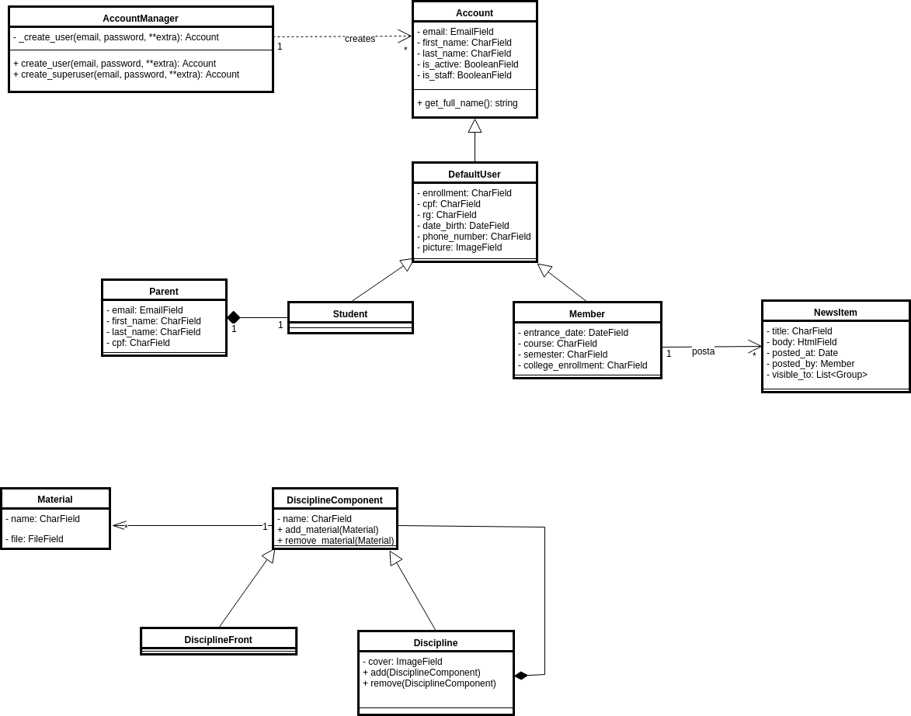

# Diagrama de Classes

## Histórico de Revisões
| Data     | Versão | Descrição                   | Autor(es)         |
|:--------:|:------:|:---------------------------:|:-----------------:|
|02/04/2018| 1.0    | Versão Inicial do Diagrama  | Felipe Hargreaves |
|04/04/2018| 1.1    | Cardinalidades e semântica  | Clarissa Borges   |
|05/04/2018| 1.2    | Esboços Iniciais            | Felipe Hargreaves |
---

## Versão Atual - 13/05/2018
Aqui se encontra a versão mais atual do diagrama, de acordo com a implementação. À medida que o sistema evolui, deve ser gerada uma versão nova do modelo, se necessário.  

### Models

### Views

## Modelo Base
Esta versão corresponde ao primeiro modelo estável realizado antes do início da implementação, e serve de base para versões futuras, contemplando o sistema como um todo.

## Versões Anteriores - 
### 06/05/2018

### 10/05/2018

## Esboços Iniciais
A título de rastreabilidade, se incluem aqui algumas versões primitivas do diagrama. Nestas o foco maior era em se modelar o domínio geral da aplicação, e destaca-se que não há grande precisão com as particularidades técnicas do artefato.

A mudança mais importante destes esboços iniciais em comparação a versões mais sofisticadas do diagrama diz respeito à organização dos diferentes tipos de usuário e suas permissões no sistema. Aqui se visualiza uma estrutura de heranças que corresponde de certa forma à hierarquia que existe nos diferentes setores do Projeto. Essa abordagem se mostrou difícil de transcrever para o modelo, pois as funções diferentes exercidas por cada tipo de membro não se adaptam de forma clara a um sistema de heranças. A alternativa adotada foi a de um sistema de grupos e permissões, removendo essas responsabilidades das classes de usuário.

