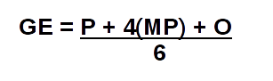

# Gerenciamento de Custos

| Data | Versão | Descrição | Autor(es) |
|:----:|:------:|:---------:|:---------:|
|02/04/2018| 0.1 | Abertuda do Documento, Introdução, Processo de Gerenciamento de Custos | Bernardo Henrique |  
|03/04/2018| 1.0 | Processo de Gerenciamento de Custos | Bernardo Henrique |  

## **1. Introdução**

### **1.1 Objetivo**
Segundo o Guia PMBOK®, o plano de gerenciamento dos custos define o formato e estabelece as atividades e os critérios de planejamento, estruturação e controle dos custos do projeto. Ele faz parte ou é um plano auxiliar do plano de gerenciamento do projeto. [2]

### **1.2 Abreviações**
* PmBok: Project Management Body of Knowledge
* EAP: Estrutura Analítica de Projeto

 
## **2. Processo de Gerenciamento de Custos**
Este tópico deverá definir os processos e técnicas que serão utilizadas para gerenciar os custos do Projeto Cascata. Para realizar este processo de forma organizada, será baseado no PmBok e organizado em quatro etapas: planejar, estimar, determinar e controlar os custos. 

### **2.1 Medição de Custos**
Para a análise dos custos será utilizada uma estimativa conhecida como Program Evaluation and Review Technique (PERT). Esta estimativa tem como foco mitigar os erros causados pela falta de certeza dos valores reais dos gastos do projeto e os riscos relacionados.

O PERT utiliza três estimativas para definir os custos, ela são a estimativa Pessimista (<b>P</b>), a Mais Provável (<b>MP</b>) e Otimista (<b>O</b>). O Gasto Estimado (<b>GE</b>) então é calculado pela seguinte fórmula: 

  

### **2.2 Recursos Humanos**
Para a estimativa de cursos de recursos humanos, será utilizado dados relativos ao custo do aluno do curso de Engenharia de Software, que é de R$26.040,00. Como o custo deverá ser medido em horas, devemos calcular a quantidade média de horas que um aluno faz por ano.

Sabendo que o curso possui 240 creditos e que seu tempo de duração é de 10 semestre. Assumindo que a seja feita a mesma quantidade de créditos por semestre, então 24, e sabendo que cada crédito é equivalente a 15 horas, temos que a carga horária do semestre é de 360 horas, então do ano 780 horas.

Com o preço do orçamento, temos que cada hora de um aluno de Engenharia de Software na UnB é de, aproximadamente, R$33,84. Como o início do projeto se deu no dia 09/03/2018 e se estende até o dia 18/06/2018, totalizando 16 semanas.

Depois de levantado uma média de horas junto ao grupo, temos que em uma estimativa Pessimistra, cada integrante do grupo trabalha 14 horas por semana, na Mais Provável é de 10 horas e a Otimista é de 8 horas. Devemos ressaltar que esta média de horas é de cada um da equipe, que possui 8 integrantes.

* Estimativa Pessimista:

| Média de Horas Integrante/Semana | Preço da Hora | Custo Semanal | Custo Total |
|:------:|:---------:|:---------:|:---------:|
| 14 horas | R$33,84 | R$3.790,08 | R$60.641,28 |

* Estimativa Mais Provável:

| Média de Horas Integrante/Semana | Preço da Hora | Custo Semanal | Custo Total |
|:------:|:---------:|:---------:|:---------:|
| 10 horas | R$33,84 | R$2.707,20 | R$43.315,20 |

* Estimativa Otimista:

| Média de Horas Integrante/Semana | Preço da Hora | Custo Semanal | Custo Total |
|:------:|:---------:|:---------:|:---------:|
| 8 horas | R$33,84 | R$2.165,76 | R$34.652,16 |

Assim, após aplicarmos o PERT, temos como resultado de gastos finais com recursos humanos o seguinte resultado:

| Média de Horas Integrante/Semana | Preço da Hora | Custo Semanal | Custo Total |
|:------:|:---------:|:---------:|:---------:|
| 10,33 horas | R$33,84 | R$2.797,44 | <b>R$44.759,04</b> |

### **2.3 Ferramentas**
Todas as ferramentas utilizadas no projeto são gratuitas, sendo assim não influenciam no custo total do projeto. Abaixo temos a relação com todas as ferramentas utilizadas:

| Ferramenta | Objetivo |
| :--------: | :------: |
| Telegram | Comunicação da Equipe |
| Hangouts | Comunicação da Equipe |
| GitHub   | Versionamento do software e da documentação |
| MkDocs   | Plataforma para organização da doumentação |
| Trello   | Organização Interna da Equipe |

### **2.4 Transporte e Locação de Espaço**
As reuniões do projeto não são feitas presencialmente, sendo assim não há necessidade de locação de espaço ou transporte, assim estes fatores não acarretam custo ao projeto.

 
### **3. Custo Final**
O projeto está em andamento, sendo assim é possível fazer apenas a estimativa de custos. Conforme discorra o tempo do projeto, estes custos serão analisados no Documento de Acompanhamento de Custos. Atualmente, a previsão final de gastos do projeto é de:

| Despesa | Custo (R$) |
| :--------: | :------: |
| Recursos Humanos | 44.759,04 |
| Ferramentas | 0 |
| Transporte e Locação de Espaço | 0 |
| <b> TOTAL </b> | <b> 44.759,04 </b> |

 
## **Referências**
[1] PMI (PROJECT MANAGEMENT INSTITUTE). Um Guia do Conhecimento em Gerenciamento de Projetos (Guia PMBOK®) – Quinta Edição. Newtown Square: Project Management Institute, 2009.

[2] Plano de Gerenciamento dos Custos, Escritório de Projetos - Dispovível em: <https://escritoriodeprojetos.com.br/plano-de-gerenciamento-dos-custos> Acessado em 02/04/2018.

[3] DevMedia. PMBOK: Trabalhando com gerenciamento de custos. - Disponível em: <https://www.devmedia.com.br/pmbok-trabalhando-com-gerenciamento-de-custos/31158>. Acessado em 02/04/2018.

[4] Relatório de Gestão 2016, Universidade de Brasília, pag. 155. Acessado em: <http://www.dpo.unb.br/index.php?option=com_phocadownload&view=file&id=558&Itemid=816>
Acessado em: 02/04/2018.