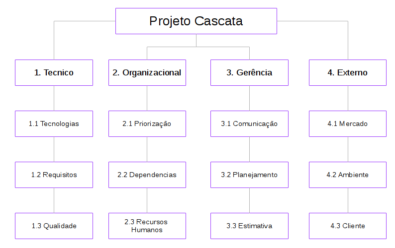

# Gerenciamento de Riscos

| Data | Versão | Descrição | Autor(es) |
|:----:|:------:|:---------:|:---------:|
|02/04/2018| 1.0 | Abertuda do Documento, Introdução, Estrutura de Riscos, Identificando os Riscos, Controle de Risco | Bernardo Henrique |  

## **1. Introdução**

Este artefato tem como objetivos identificar os riscos durante o andamento do Projeto Cascata. Estes serão apresentados, a análise ocorrerá de forma qualitativa e quantitativa, apresentando as causas, soluções e  grau de impacto. Com estas análises, buscará mitigar os impactos destes riscos no projeto.

 
## **2. Estrutura de Riscos**
Os riscos de um projeto pode ser separados em quatros grandes áreas, abaixo pode-se observar a EAR do projeto.

  

### **2.1 Técnico**
1. **Tecnologias:** Referente às tecnologias e ferramentas utilizadas no projeto, como dificuldade de aprendizado da tecnologia.
2. **Requisitos:** Referente aos requisitos do projeto, como levantamento errôneo dos requisitos.
3. **Qualidade:** Refente à qualidade do produto, como usabilidade.

### **2.2 Organizacional**
1. **Priorização:** Referente à possibilidade de erros caso a priorização dos módulos do projeto não seja feita de forma correta.
2. **Dependencias:** Referente à possibilidade de erros caso a dependencia entre os módulos não seja feita de forma correta.
3. **Recursos Humanos:** Referente à mau gestão dos integrantes do projeto.

### **2.3 Gerência de Projetos**
1. **Comunicação:** Referente à falha de comunicação da equipe.
2. **Planejamento:** Referente às falhas de planejamento do projeto.
3. **Estimativa:** Referente à má estimativa da capacidade de trabalho da equipe.
  
### **2.4 Externo**
1. **Mercado:** Referente às condições do mercado em que o produto está inserido.
2. **Ambiente:** Referente ao ambiente que em qual o projeto está inserido, neste caso o acadêmico.
3. **Cliente:** Refere-se aos riscos relacionados  ao cliente, como aprovação do produto.

 
## **3. Análise Quantitavas e Qualitativas**
A análise quantitativa de riscos será feita em três passos: primeiramente analisará a probabilidade de acontecimento. Depois será analisado o impacto que este risco poderá trazer ao projeto. Assim, para definir-se a prioridade com que o risco deverá ser tratado, será feita uma matriz traçando sua probabilidade e impacto, gerando em uma pontuação para cadas risco.

### **3.1 Probabilidade**
| Probabilidade | Porcentagem | Peso |
| :-----------: |:----------: | :--: |
| Muita baixa   | 0 - 20      | 1    |
| Baixa         | 21 -40      | 2    |
| Média         | 41-60       | 3    |
| Alta          | 61-80       | 4    |
| Muito Alta    | 81-100      | 5    |

### **3.2 Impacto**
| Probabilidade | Impacto | Peso |
| :-----------: |:----------: | :--: |
| Muita baixo   | Inexpressivo   | 1 |
| Baixo  | Pouco   | 2 |
| Médio  | Considerável    | 3 |
| Alto   | Grande    | 4 |
| Muito Alto | Inviabiliza o Projeto   | 5 |

### **3.3 Prioridade**
   A tabela abaixo representa a pontuação de um risco, a qual definirá sua prioridade:

| Prob./Imp. | Muito Baixo | Baixo | Médio | Alto | Muito Alto |
| :--: |:--: | :--: | :--: |:--: | :--: |
| Baixa | 1 | 2 | 3 | 4 | 5 |
| Muito Baixa | 2 | 4 | 6 | 8 | 10 |
| Média | 3 | 6 | 9 | 12 | 15 |
| Alta | 4 | 8 | 12 | 16 | 20 |
| Muito Alta | 5 | 10 | 15 | 20 | 25 |

A prioridade será definida em três níveis: Alta, Média e Baixa, de acordo com as pontuações e na seguinta estrutura:

| Prioridade | Pontuação |
| :--------: |:--------- |
| Baixa  | 1-5 |
| Média  | 6-14 |
| Alta  | 15-25 |

 
## **4. Identificando os Riscos**

### **4.1 Riscos Técnicos**
| ID | Risco | Possibilidade | Impacto | Monitoramento | Prioridade |
|:-: |:----: |:-------:|:------------: |:---------:| :------: |
| R01 | Dificuldade de aprendizado da tecnologia | Baixa (2) | Médio (3) | Pareamento | Média |
| R02 | Dificuldade elicitar requisitos | Média (3) | Alto (4) | Aplicação de tecnicas de elicitação, prototipação e contato constante com o cliente | Média |
| R03 | Mudança de Escopo | Médio (3) | Alto (4) | Contato com o cliente | Média |
| R04 | Interface com baixa qualidade | Muito Baixa (1)  | Médio (2) | Prototipação | Baixa |

### **4.2 Riscos Organizacionais**
| ID | Risco | Possibilidade | Impacto | Monitoramento | Prioridade |
|:-: |:----: |:-------:|:------------: |:---------:| :------: |
| R05 | Desistência de membros da equipe | Média (3) | Muito Alto (4) | - | Alta |
| R06 | Dependência de Tarefas | Muito Alta (5) | Médio (3)  | Reuniões de Equipe | Alta |
| R07 | Priorização Errônea | Baixa (1) | Médio (3) | Reuniões de Equipe | Baixa |
| R08 | Falha de Comunicação entre a Equipe | Média (3)  | Médio (3) | Daily Meetings | Média |

### **4.3 Riscos de Gerência de Projeto**
| ID | Risco | Possibilidade | Impacto | Monitoramento | Prioridade |
|:-: |:----: |:-------:|:------------: |:---------:| :------: |
| R09 | Falha no planejamento | Média (3) | Alto (4) | Cronograma | Média |
| R10 | Mudança no Plano de Ensino da Matéria | Muito Baixa (1) | Médio (3) | Moodle | Baixa |
| R11 | Estimar esforço de forma errônea | Média (3) | Médio (3) | Brundown da Equipe | Média |
| R12 | Atraso na Entrega  | Baixa (2) | Alto (4) | Cronograma | Média |

### **4.3 Riscos de Gerência de Projeto**
| ID | Risco | Possibilidade | Impacto | Monitoramento | Prioridade |
|:-: |:----: |:-------:|:------------: |:---------:| :------: |
| R13 | Greve da UNB | Média (3) | Muito Alto (5) | - | Alta |
| R14 | Finalização do Projeto Cascata | Muito Baixa (1) | Muito Alto (5) | Reunições com o cliente | Média |

 
### **5. Controle dos Riscos**
> "Controlar os riscos é o processo de implementação de planos de respostas, acompanhamento dos riscos identificados, monitoramento dos riscos residuais, identificação de novos riscos e avaliação da eficácia do processo de riscos durante todo o projeto. Durante o projeto, o riscos se encontrarão sob constante reavaliação e para a realização de um controle efetivo, a equipe estará sujeita a reuniões periódicas, execução do plano de comunicação, do plano de qualidade, monitoramento do EVM, entre outros." PMBOK, 2013.

Desta forma, a equipe estará sempre a par do andamento do projeto, da motivação dos seus integrantes, das necessidades do clientes e vários outros fatores que possam afetar o andamento do projeto.

 
## **Referências**

PMI. Um guia do conhecimento em gerenciamento de projetos. Guia PMBOK 5a. ed. - EUA: Project Management Institute, 2013.