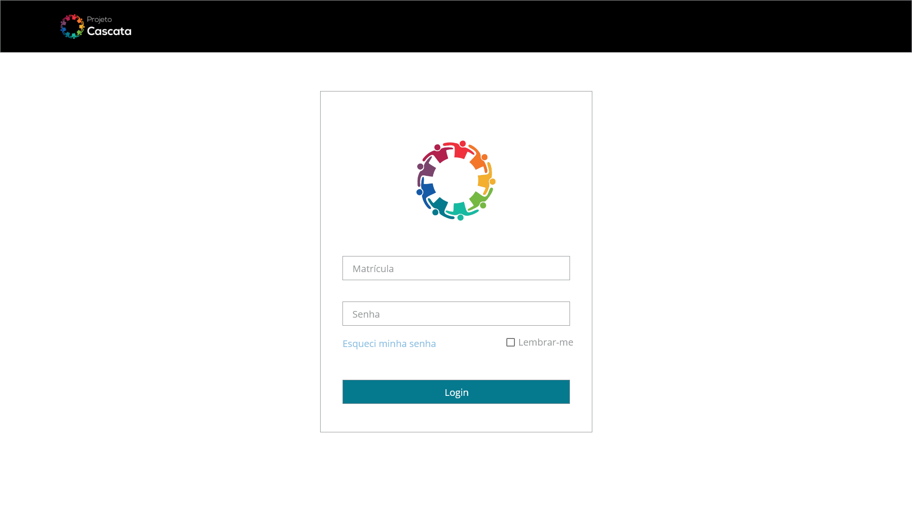
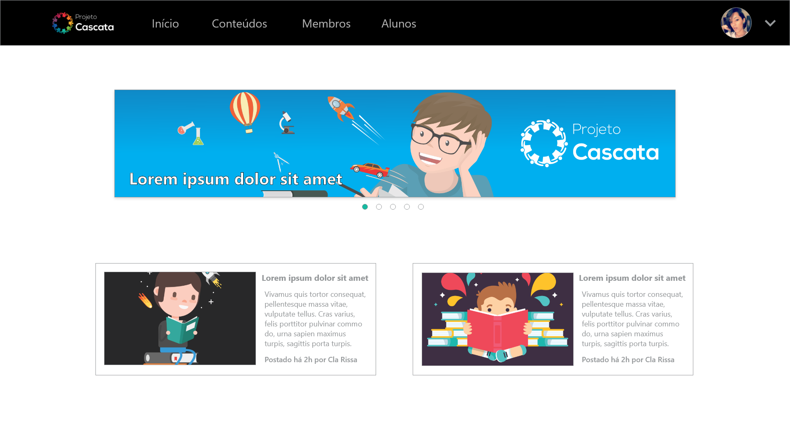
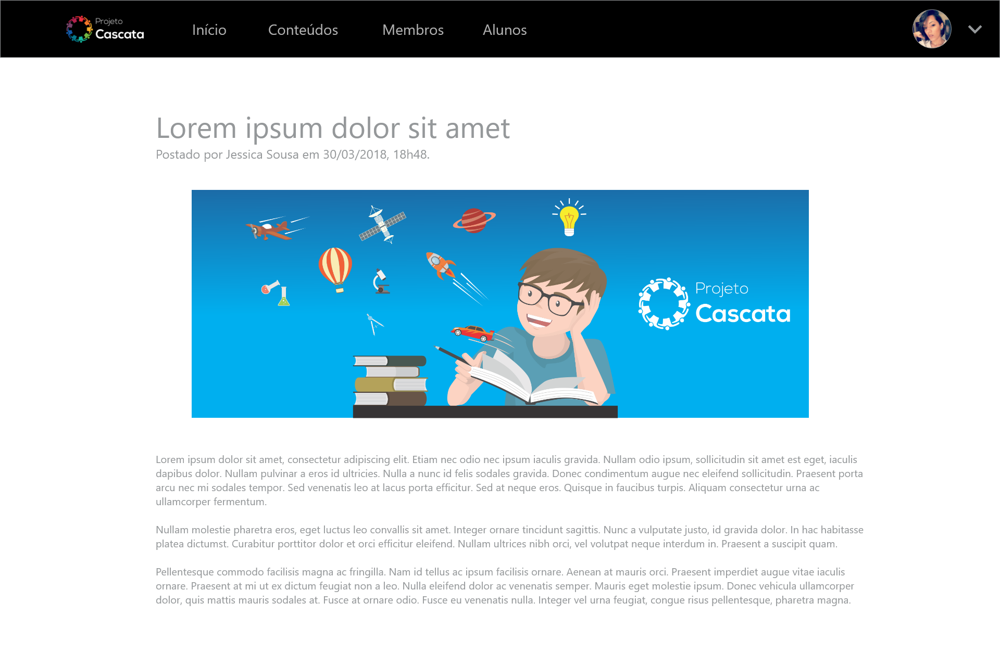
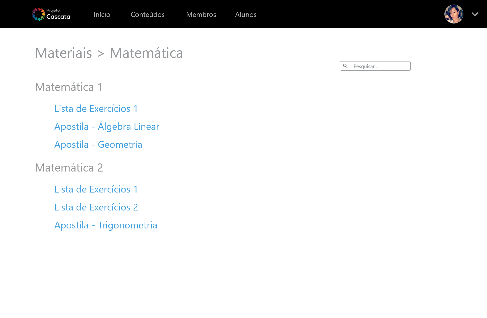
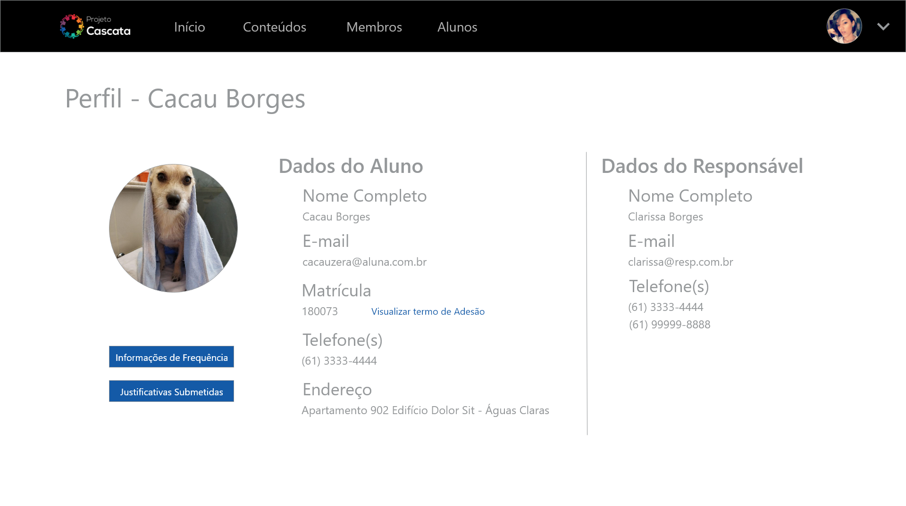
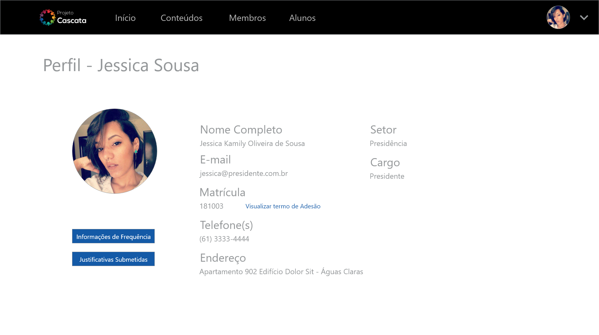

# Protótipo
*Protótipo feito por Clarissa e Felipe no dia 30/03/2018*

O protótipo de alta fidelidade foi feito na ferramenta *Adobe XD* e pode ser acessado clicando [aqui](https://xd.adobe.com/view/01563e16-ffe2-440f-a456-ef74865c30cf?fullscreen). A seguir são exibidas algumas telas de maior relevância.

## Login

## Feed de Notícias

## Visão Individual de Notícia

## Lista de Disciplinas

## Visão de Materiais

## Ocorrências

## Perfil - Aluno

## Perfil - Membro
