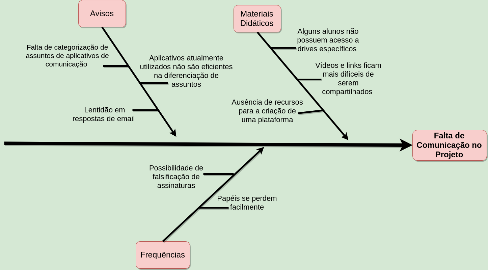

# Diagrama de Ishikawa

### Histórico de Revisões

| Data | Versão | Descrição | Autor(es) |
|:----:|:------:|:---------:|:-----:|
|22/03/2018|1.0|Elaboração do Diagrama| Bruna e Letícia |
|28/03/2018|1.2|Explicação sobre o diagrama e acréscimo do histórico de revisão|Letícia|  

---   
## Diagrama de Ishikawa

> "Um diagrama de Ishikawa, também conhecido como diagrama de causa e efeito ou diagrama de espinha de peixe, é frequentemente usado no gerenciamento de qualidade em indústrias de manufatura". (WONG, Kam Cheong, 2011).

A elaboração do diagrama a seguir visou auxiliar na gerência e Controle da Qualidade do produto, identificando causas para um efeito problema, no caso do Projeto Cascata, a falta de comunicação no projeto.

 
## **Referências**

1. WONG, Kam Cheong. Using an Ishikawa diagram as a tool to assist memory and retrieval of relevant medical cases from the medical literature. 2011.

2. Ávila, Rafael. Diagrama de Ishikawa: oque é e como fazer. Disponível em: <https://blog.luz.vc/o-que-e/diagrama-de-ishikawa/> . Acesso em: 22 de março de 2018.
