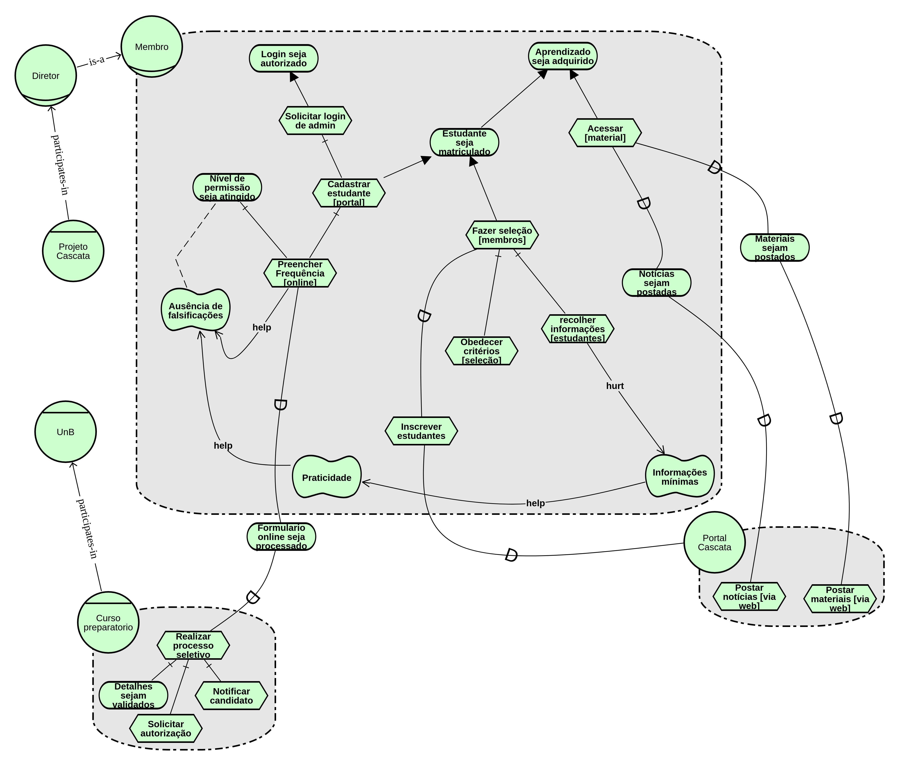

# I* - Modelagem Intencional

### Histórico de Revisões

| Data | Versão | Descrição | Autor(es) |
|:----:|:------:|:---------:|:-----:|
|01/04/2018|1.0|Criação da página e adição da descrição e referências| Letícia |
|02/04/2018|1.1|Adição do Strategic Rationale Model| Letícia |
|04/04/2018|1.2|Adição do Strategic Dependency Model| Halê |
|05/04/2018|1.3|Segunda Versão do SR| Letícia   

 ---

O termo I* refere-se ao conceito de intencionalidade distribuída, sendo assim, esse framework propõe uma abordagem orientada a agentes para a engenharia de requisitos, centrando-se nas características intencionais do agente. Os agentes atribuem propriedades intencionais entre si e racionam sobre relacionamentos estratégicos. As dependências entre os agentes geram oportunidades e vulnerabilidades. As dependências são analisadas usando uma abordagem de raciocínio qualitativo. Os agentes consideram configurações alternativas de dependências para avaliar seu posicionamento estratégico  em um contexto.

## i* - Strategic Dependency Model - SD

## i* - Strategic Rationale Model - SR

### 1ª versão

### 2ª Versão - pós revisões

## **Referências**

1.CS Toronto. i* an agent- and goal-oriented modelling framework. Disponível Aqui. Acesso em: 1 de outubro de 2017.

2. [Open Acess] Leite, Julio Cesar Sampaio do Prado. Livro Vivo- Engenharia de Requisitos. http://livrodeengenhariaderequisitos.blogspot.com.br/ (útimo acesso: 2018)
