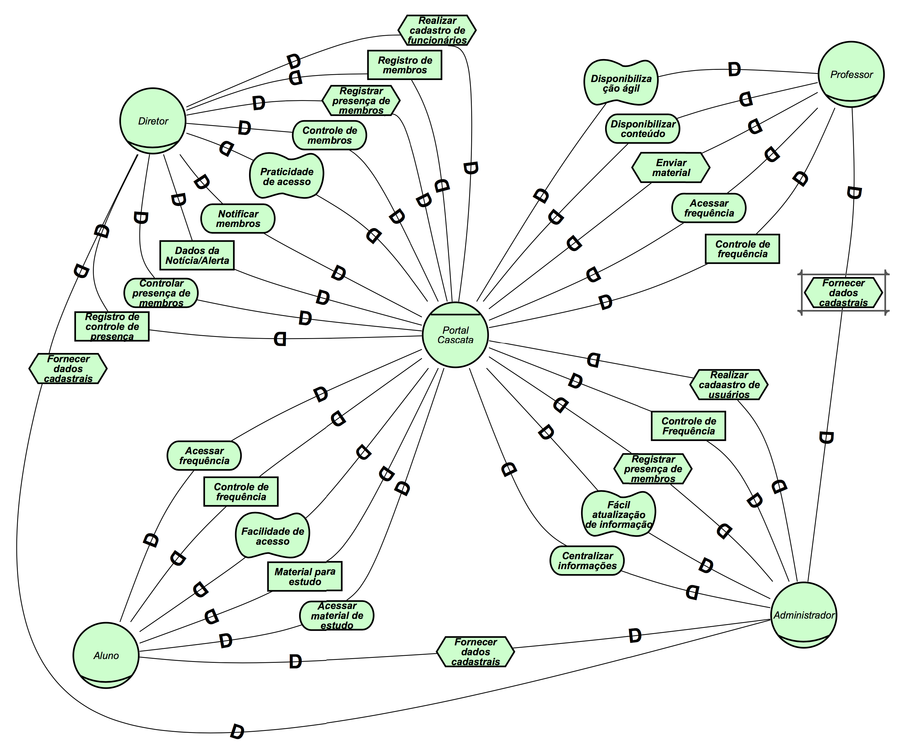
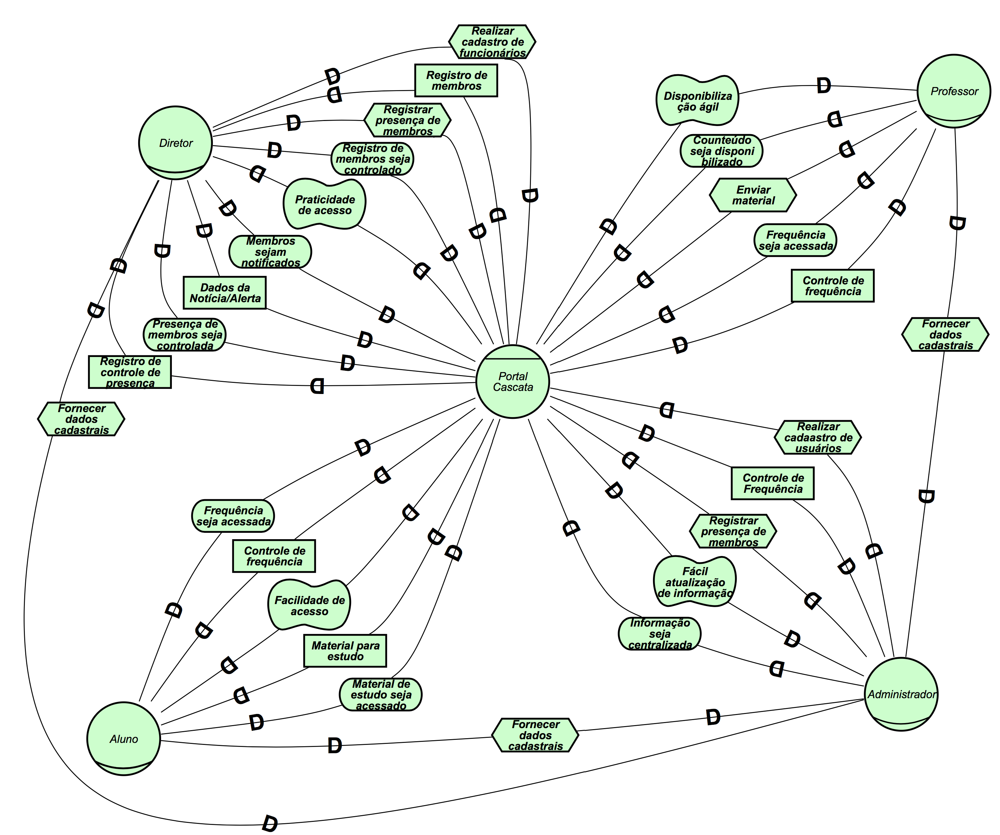
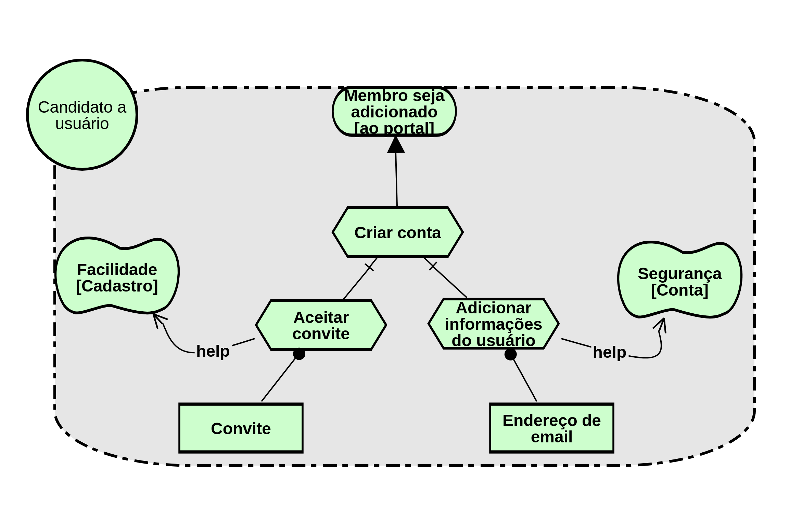

# I* - Modelagem Intencional

### Histórico de Revisões

| Data | Versão | Descrição | Autor(es) |
|:----:|:------:|:---------:|:-----:|
|01/04/2018|1.0|Criação da página e adição da descrição e referências| Letícia |
|02/04/2018|1.1|Adição do Strategic Rationale Model| Letícia |
|04/04/2018|1.2|Adição do Strategic Dependency Model| Halê |
|05/04/2018|1.3|Segunda Versão do SR e adição de textos explicativos| Letícia |
|06/04/2018|1.4|Adição da segunda versão do modelo SD| Halê |

 ---

O termo I* refere-se ao conceito de intencionalidade distribuída, sendo assim, esse framework propõe uma abordagem orientada a agentes para a engenharia de requisitos, centrando-se nas características intencionais do agente. Os agentes atribuem propriedades intencionais entre si e racionam sobre relacionamentos estratégicos. As dependências entre os agentes geram oportunidades e vulnerabilidades. As dependências são analisadas usando uma abordagem de raciocínio qualitativo. Os agentes consideram configurações alternativas de dependências para avaliar seu posicionamento estratégico  em um contexto.

## i* - Strategic Dependency Model - SD

> "O modelo SD é usado para expressar a rede de relacionamentos estratégicos intencionais entre os atores. Os diagramas SD descrevem as dependências estratégicas entre os Atores, mas não descrevem o racional interno por trás dessas dependências."

A figura abaixo representa um modelo estratégico de dependência que apresenta as principais funcionalidades do Portal Cascata.

### 1ª Versão

### 2ª Versão

## i* - Strategic Rationale Model - SR

> "O modelo SR é um grafo, com vários tipos de nós e links que trabalham juntos para fornecer uma estrutura representacional para expressar as razões por trás das dependências. Os atores com o modelo SD são "abertos" para mostrar suas intenções específicas."

Além da modelagem estratégica de dependência, foi elaborado mais um modelo, que representa os atores e suas áreas de fronteiras, que limitam o escopo da atuação de cada um dos atores, sendo a representação de seus Rationales.

### 1ª Versão

### 2ª Versão - pós revisões

### Versão SR de Visão de Usuário

## **Referências**

1.CS Toronto. i* an agent- and goal-oriented modelling framework. Disponível Aqui. Acesso em: 1 de outubro de 2017.

2. [Open Acess] Leite, Julio Cesar Sampaio do Prado. Livro Vivo- Engenharia de Requisitos. http://livrodeengenhariaderequisitos.blogspot.com.br/ (útimo acesso: 2018)

3.[Open Acess] iStarQuickGuide - http://istar.rwth-aachen.de/tiki-index.php?page=iStarQuickGuide (ultimo acesso: 2018)

4.[Link da Ferramenta Utilizada] PIstar tool - http://www.cin.ufpe.br/~jhcp/pistar/tool/#
