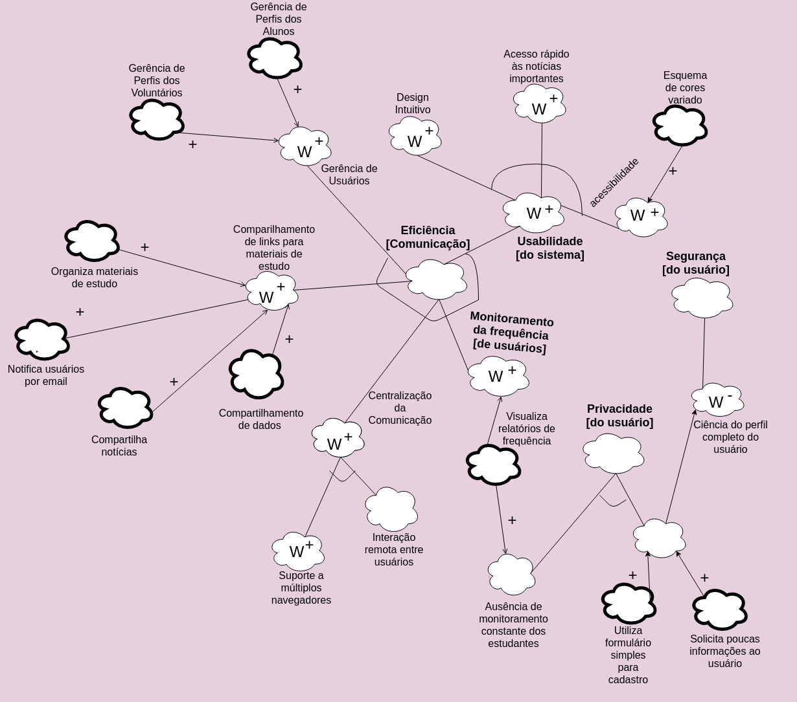

# NFR Framework - Modelagem de Requisitos Não Funcionais

### Histórico de Revisões

| Data | Versão | Descrição | Autor(es) |
|:----:|:------:|:---------:|:-----:|
|31/03/2018|1.0|Modelagem do NFR - versão inicial| Bernardo e Letícia |
|01/04/2018|1.1|Ajustes no modelo e adição da descrição e referências| Letícia |

O NFR Framework visa priorizar os requisitos não funcionais como usabilidade, segurança e privacidade para gerar o processo de design em geral, enquanto a maioria das abordagens convencionais para o design do sistema são orientadas por requisitos funcionais, o NFR framework procura colocar os requisitos não funcionais em primeiro lugar na mente do desenvolvedor.

## Modelo NFR - Versão inicial

## Modelo NFR - Versão SR_revisado_Leticia

## **Referências**

1. Chung L., Nixon B.A., Yu E., Mylopoulos J. (2000) The NFR Framework in Action. In: Non-Functional Requirements in Software Engineering. International Series in Software Engineering, vol 5. Springer, Boston, MA
