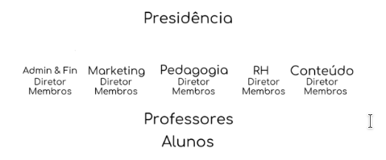

# Perfil de Usuários

É importante definir os papéis para que o sistema seja capaz de suprir todas as demandas apresentadas pelos diferentes perfis de usuários. O Projeto Cascata possui uma hierarquia com quatro diferentes papéis: Presidência, Diretores, Professores e Alunos. Como apresentado abaixo:

No sistema, a Presidência será representado como Diretores, por estes possuírem o mesmo papel no sistema. Outro usuário importante é o Administrador do sistema.

|      Papel      |                                        Descrição                                        |                                                                           Interação com o sistema                                                                           |
| :-------------: | :-------------------------------------------------------------------------------------: | :-------------------------------------------------------------------------------------------------------------------------------------------------------------------------: |
| Administradores |     São os responsáveis pela administração/manutenção dos usuários daquele sistema.     |                                        Realiza a manutenção de usuários do sistema. Por exemplo, a criação e a remoção de usuários.                                         |
|     Alunos      |        São o público alvo do sistema, aqueles que irão consumir algum conteúdo.         | Se inscrevem em determinados cursos, realizam atividades e postam dúvidas no fórum. Podem escolher assuntos de seu interesse para receberem notícias.Visualizam frequência. |
|    Diretores    | São os responsáveis por setores estratégicos do projeto, desde RH à gestão de conteúdo. |                                                Postam notícias, devem ser capazes de restringir o acesso a certas notícias.                                                 |
|   Professores   |               São os responsáveis por ministrar as aulas para os alunos.                |      Postam novos conteúdos e atividades em seus respectivos cursos. Fazem um registro das atividades desenvolvidas por cada aluno.,Mantém as frequências dos alunos.       |
