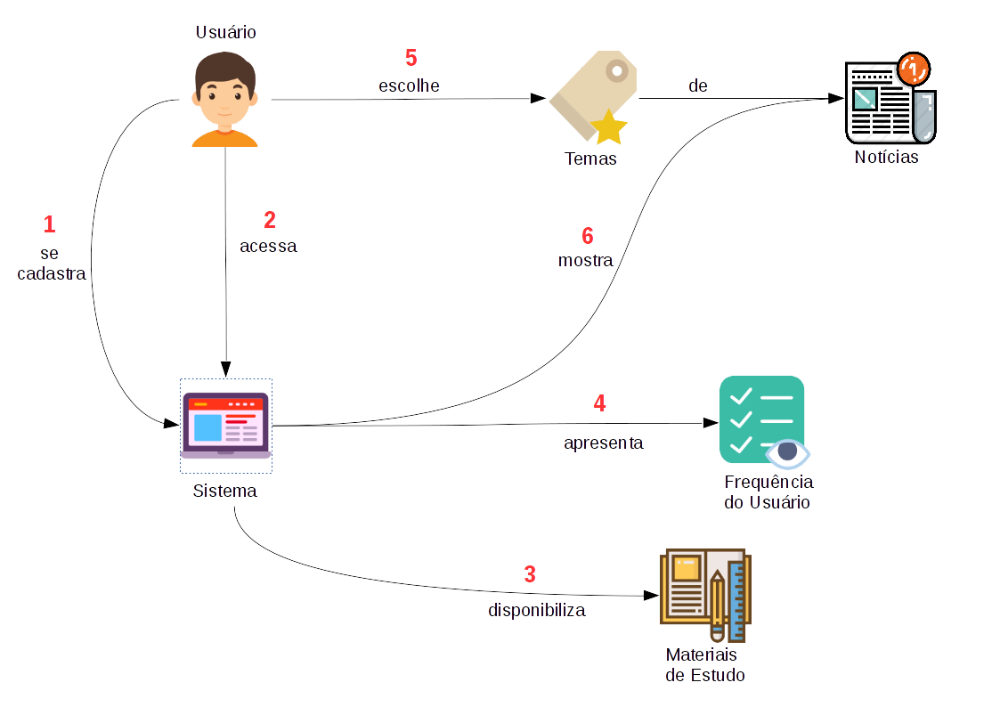
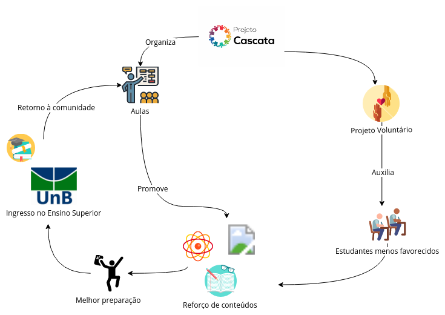
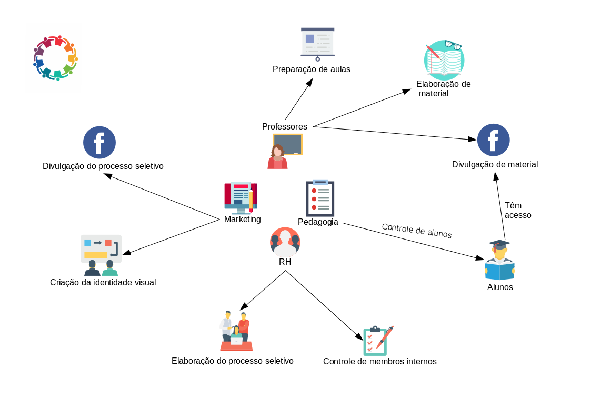

# Rich Picture

| Data | Versão | Descrição | Autor(es) |
|:----:|:------:|:---------:|:---------:|
|22/03/2018|1.0| Adição do Rich Picture da Visão do Usuário | Bernardo Henrique |
|23/03/2018|1.0| Adição do Rich Picture das funcionalidades do sistema | Leticia de Souza|
|24/03/2018|1.0| Adição do Rich Picture de Contexto Externo | Felipe Hargreaves |
|31/03/2018|2.0| Adição do Rich Picture da Organização Interna | Mariana Pícolo |   

---

*Rich pictures* são representações visuais que buscam entender o contexto de determinada atividade.

## Visão do Usuário - Bernardo

## Rich Picture com foco nas funcionalidades do sistema - Letícia

## Contexto Externo - Felipe

## Organização Interna - Mariana

