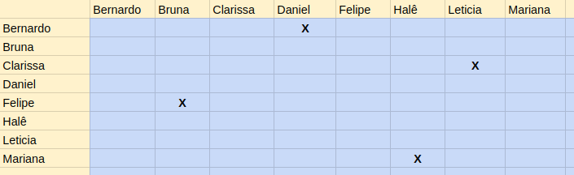

# ** <i>Sprint</i> 1 **

Número da <i>sprint</i>: 0

Data de Início: 20/04/2017

Data de Término: 04/05/2017

Duração: Quatorze Dias (Duas Semanas)

Scrum Master: Mariana Pícolo

## ** 1. Pareamento** 

## ** 1. Planejamento das Histórias ** 
Para esta <i>sprint</i>, foram continuadas histórias que não foram fechadas na <i>sprint</i> anterior, além de serem designadas novas histórias. Nesta <i>sprint</i> não foram realizadas histórias técnicas.

## ** 2. Histórias **

### ** US07 Ver perfil ** 
** Descrição: ** Eu, como membro do projeto, desejo ver o perfil de outros usuários do sistema para que eu possa ter acesso aos seus dados.

** Critérios de Aceitação: **

Exibir o perfil de um aluno;

Exibir o perfil de um administrador.

** Responsáveis: ** Clarissa Lima e Mariana Pícolo.
  

### ** US10 Listar Alunos ** 
** Descrição: ** Eu, como membro do projeto, desejo listar os membros para ter acesso a todos os membros cadastrados no sistema.

** Critérios de Aceitação: **

Deve ser possível buscar os membros listados pelo nome.

** Responsáveis: ** Bernardo Henrique e Daniel Teles.
  

### ** US19 Ver notícia detalhadamente ** 
** Descrição: ** Eu, como usuário, desejo ter uma visão detalhada de uma notícia escolhida na lista de notícias para que eu possa ler a notícia por completo.

** Critérios de Aceitação: **

Apenas os grupos de usuários apropriados terão permissão para acessar notícias (admin, diretores, RH).

** Responsáveis: ** Halê Valente e Mariana Pícolo.
  

### ** US20 Publicar Notícias ** 
** Descrição: ** Eu, como diretor do projeto, desejo publicar notícias para que os outros usuários possam ver os informes que lhes competem.

** Critérios de Aceitação: **

Apenas os grupos de usuários apropriados terão permissão para criar notícias (admin, diretores, RH).

O usuário pode indicar quais grupos terão acesso a uma determinada notícia (pública, apenas usuários cadastrados, funções específicas).

** Responsáveis: ** Bruna Pinos e Felipe Hargreaves.
  

### ** US38 Enviar convite de cadastro ** 
** Descrição: ** Eu, como administrador, desejo enviar um convite de acesso ao sistema para que um usuário possa se cadastrar.

** Responsáveis: ** Clarissa Lima e Leticia Souza.
  

## ** 4. Fechamento da <i>Sprint</i> **
| Histórias Planejadas | Status |
|----------------------|--------|
| US07: Ver perfil | Incompleto |
| US10: Listar Alunos  | ** Completo ** | 
| US19: Ver notícia detalhadamente | Incompleto |  
| US20: Publicar Notícias | ** Completo ** |  
| US38: Enviar convite de cadastro | Incompleto |  

## ** 4. Análise do Scrum Master **
Nesta <i>sprint</i>, não foram realizadas histórias técnicas e duas, das cinco, histórias de usuário planejadas foram implementadas. Estas histórias não foram entregues pelos seguintes fatos: 

* Durante o período da <i>Sprint</i> 1 os membros se encontraram atarefados com outras disciplinas.
* Alguns membros ainda possuem dificuldade na tecnologia usada.
* Dificuldade de encontrar horários com a dupla de pareamento.

Nesta <i>sprint</i>, foi constatada uma queda na produtividade dos membros em comparação com a <i>sprint</i> anterior. Os pareamentos continuaram os mesmos, com o objetivo de sanar as dívidas técnicas das <i>sprints</i> anteriores.    

Um dos problemas constatados durante a <i>sprint</i>, foi a falta de disponibilidade dos membros do grupo para pareamentos, por conta da proximidade da data da prova 1.   
Os membros optaram por priorizar os estudos para a prova, que também traria benefícios ao projeto, já que o conhecimento dos padrões estaria solidificado, uma vez que foram estudados extensivamente para a prova.

A não entrega das tarefas pode dificultar o desenvolvimento das tarefas a seguir, uma vez que as histórias priorizadas para essa <i>sprint</i> são base para o restante do software. As histórias que não foram concluídas serão replanejadas para as próximas <i>sprints</i>.