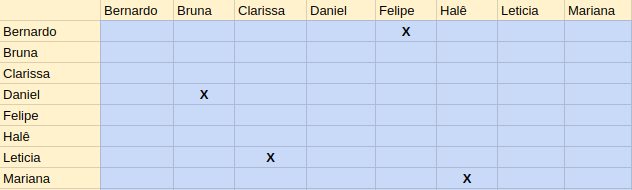

# ** <i>Sprint</i> 2 **

Número da <i>sprint</i>: 2

Data de Início: 05/05/2017

Data de Término: 11/05/2017

Duração: Sete Dias (Uma Semanas)

Scrum Master: Bernardo Henrique

## ** 1. Pareamento** 

## ** 1. Planejamento das Histórias ** 
Para esta <i>sprint</i>, foram continuadas histórias que não foram fechadas na <i>sprint</i> anterior, além de serem designadas novas histórias. Nesta <i>sprint</i> foi realizada apenas uma história tecnica.

## ** 2. Histórias **

### ** US08 Perfil Usuário** 
** Descrição: ** Eu, como usuário, desejo ver o meu perfil para que eu possa verificar os meus dados.

** Responsáveis: ** Daniel Teles e Bruna Pinos.
  

### ** US18 Listar Notícias** 
** Descrição: ** Eu, como usuário, desejo ver uma lista de notícias que corresponde a minha função no sistema para que eu esteja informado sobre as notícias que cabem a mim.

** Responsáveis: ** Halê Valente e Mariana Pícolo.
  

### ** US19 Ver notícia detalhadamente ** 
** Descrição: ** Eu, como usuário, desejo ter uma visão detalhada de uma notícia escolhida na lista de notícias para que eu possa ler a notícia por completo.

**Critérios de aceitação:**

* Apenas os grupos de usuários apropriados terão permissão para acessar notícias (admin, diretores, RH).

** Responsáveis: ** Halê Valente e Mariana Pícolo.
  

### ** US28 Criar Frente ** 
** Descrição: ** Eu como administrador desejo criar uma frente para organizar a disciplina de acordo com as suas divisões

** Responsáveis: ** Bernardo Henrique e Felipe Hargreaves.
  

### ** US29 Editar Disciplinas ** 
** Descrição: ** Eu, como administrador, desejo editar uma disciplina para que ela esteja atualizada e corrigida.

** Responsáveis: ** Bernardo Henrique e Felipe Hargreaves.
  

### ** US30 Editar Frente ** 
** Descrição: ** Eu, como administrador, desejo editar uma disciplina para que ela esteja atualizada e corrigida.

** Responsáveis: ** Bernardo Henrique e Felipe Hargreaves.
  

### ** US31 Remover Disciplina ** 
** Descrição: ** Eu, como administrador, desejo remover uma disciplina para que uma disciplina que esteja fora do contexto do projeto não esteja mais cadastrada no sistema.

** Responsáveis: ** Bernardo Henrique e Felipe Hargreaves.
  

### ** US32 Remover Frente ** 
** Descrição: ** Eu, como administrador, desejo remover uma frente para que uma frente que esteja fora do contexto do projeto não esteja mais cadastrada no sistema.

** Responsáveis: ** Bernardo Henrique e Felipe Hargreaves.
  

### ** US38 Enviar Convite de Cadastro ** 
** Descrição: ** Eu, como administrador, desejo enviar um convite de acesso ao sistema para que um usuário possa se cadastrar.

** Responsáveis: ** Clarissa Lima e Letícia Souza.
  

### ** TS Adicionar navegação entre páginas ** 
** Descrição: ** Adicionar navegação entre as páginas do projeto.

** Responsável: ** Felipe Hargreaves.
  

## ** 4. Fechamento da <i>Sprint</i> **
| Histórias de Usuário Planejadas | Status |
|----------------------|--------|
| US08: Perfil Usuário | ** Completo **  |
| US18: Listar Notícias |  Incompleto  |
| US28: Criar Frente  | ** Completo ** | 
| US29: Editar Disciplinas | ** Completo **  |  
| US30: Editar Frente | ** Completo ** |  
| US31: Remover Disciplina | ** Completo **  |  
| US32: Remover Frente | ** Completo **  |  
| US38: Enviar Convite de Cadastro | Incompleto  |  

| Histórias Técnicas Planejadas | Status |
|----------------------|--------|
| Adicionar navegação entre páginas | Completo |

## ** 4. Análise do Scrum Master **
Nesta <i>sprint</i> foi realizada  uma histórias técnicas e seis, das oito, histórias de usuário planejadas foram implementadas. Estas histórias não foram entregues pelos seguintes fatos: 

* Durante o período da <i>Sprint</i> 2 os membros se encontraram atarefados com outras disciplinas.
* Alguns membros ainda possuem dificuldade na tecnologia usada.
* Dificuldade de encontrar horários com a dupla de pareamento.
* Um dos membros da equipe se encontrou internado durante o período da sprint.

Nesta <i>sprint</i>, foi constatada aumento na produtividade dos membros em comparação com a <i>sprint</i> anterior. Houve rotação de pareamento com o intuito de haver nivelamento de conhecimento.

A não entrega das tarefas pode dificultar o desenvolvimento das tarefas a seguir, uma vez que as histórias priorizadas para essa <i>sprint</i> são base para o restante do software. As histórias que não foram concluídas serão replanejadas para as próximas <i>sprints</i>.